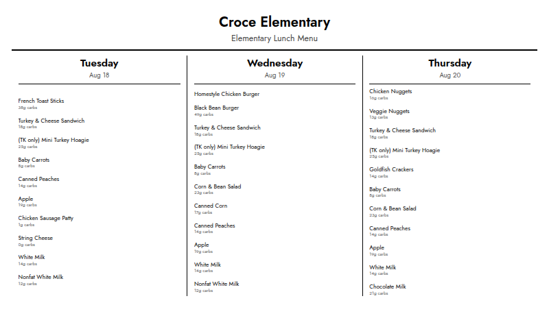

# InkyPi-Nutrislice

Displays your school's cafeteria menu — with per-item carb counts — from Nutrislice on your [InkyPi](https://github.com/fatihak/InkyPi) e-ink display.



## Features

- Shows the menu for 1 day, 3 days, or the full week
- Optionally displays carb counts (grams) alongside each food item
- Works with any school district that uses Nutrislice
- Item text and spacing auto-scale so busy menu days (many entrees/sides) don't get clipped

## Installation

Install the plugin from this GitHub repository:

```bash
inkypi plugin install nutrislice https://github.com/cartagena/InkyPi-Nutrislice
```

If you're running a fork of InkyPi rather than the upstream project, check that fork's own documentation — plugin installation and loading steps can differ.

## Configuration

| Setting | Description |
| --- | --- |
| **School Menu Url** | Required. The url for your school's menu on your district's Nutrislice site, e.g. `https://<district>.nutrislice.com/menu/<school>/<meal-type>/`. Visit your district's Nutrislice site, select your school and a meal (lunch or breakfast), and copy that page's url. |
| **Days to Show** | `1 Day`, `3 Days`, or `Full Week`. Days with no published menu (weekends, holidays) are skipped automatically. |
| **Show Carbs** | Toggle to show/hide the carbohydrate count (in grams) for each food item. |

## External API

This plugin depends on **Nutrislice**, the vendor that powers school district meal-menu websites (e.g. `https://<district>.nutrislice.com`).

- **API documentation:** None published. Nutrislice does not offer a public/official API or developer docs — this plugin calls the same unauthenticated JSON endpoint their own website's frontend uses (`https://<district>.api.nutrislice.com/menu/api/weeks/school/<school>/menu-type/<meal-type>/<year>/<month>/<day>/?format=json`), reverse-engineered from [kblankenship1989/MMM-nutrislice-menu](https://github.com/kblankenship1989/MMM-nutrislice-menu), a MagicMirror module for the same service. The general [Nutrislice product site](https://www.nutrislice.com/) is the only official reference.
- **API key:** Not required. The endpoint is public and unauthenticated — you only need your district's Nutrislice menu url (see Configuration above).
- **Usage limits / cost:** Free, with no published rate limits or usage tiers (there's nothing to sign up for). Because the API is undocumented and unofficial, Nutrislice could change or restrict it without notice — see Maintenance status below.

## Testing

Two suites, split by what they need. **No test in either one contacts a real Nutrislice server** — the menu API is mocked everywhere.

### Unit tests — run anywhere

No InkyPi, no network, no browser. From a bare clone:

```bash
pip install -r requirements-dev.txt
pytest tests/unit
```

Covers URL parsing, meal-type label formatting, item-scale bounds, settings validation, menu-item parsing, date filtering/dedup in `extract_days`, and the two-week fetch fallback.

`tests/conftest.py` stands in for the host modules the plugin imports (`BasePlugin`, the settings-schema DSL, `get_http_session`, `get_timezone`). The stubbed `render_image` deliberately raises rather than returning a fake image, and the stubbed HTTP session refuses to make requests, so neither a template regression nor an accidental live call can pass here.

### Integration tests — need a real InkyPi checkout

Runs against the real `BasePlugin`, the real plugin registry, the real Jinja + headless-Chromium render pipeline, and the real `settings_schema.html` macros (which is what catches a field kwarg the macros silently ignore).

```bash
git clone https://github.com/jtn0123/InkyPi ../InkyPi
ln -s "$PWD/nutrislice" ../InkyPi/src/plugins/nutrislice
INKYPI_PATH=../InkyPi pytest tests/integration
```

Without `INKYPI_PATH` these are skipped, not failed, so a plain `pytest` from a clean clone still exits green having run the unit suite.

CI runs both, plus the *unit* suite a second time with `INKYPI_PATH` set — the same tests unstubbed, so a stub that has drifted from InkyPi's real behavior surfaces as a failure instead of quietly still passing.

## Development status

**Actively maintained.** This plugin relies on Nutrislice's unofficial API, which may change without notice. If it stops fetching data, check whether the JSON response shape at the endpoint above has changed, and open an issue in this repo.
